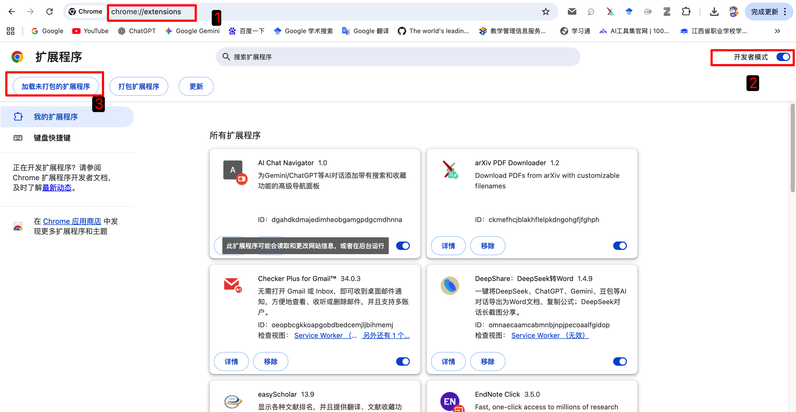

# AI-Chat-Navigator

AI-Chat-Navigator 是一个 Chrome 扩展，为 ChatGPT / Gemini 等对话页面提供“目录导航 + 收藏管理 + 快捷操作”，帮助你在长对话中快速定位、检索、复用重要 Prompt。

---

## 预览

---

## 主要功能

- **对话目录导航**
  - 自动提取对话中的 Prompt 列表
  - 点击即可快速跳转定位到对应位置（支持居中定位）
  - 搜索过滤（快速查找某条 Prompt）

- **收藏管理**
  - 一键收藏/取消收藏
  - 支持批量收藏、批量删除
  - 收藏支持 **文件夹/分类**（便于大量收藏的分组管理）
  - 支持收藏编辑（长内容编辑体验更好）

- **多选与快捷键**
  - `Command + 单击`：多选 Prompt（macOS）
  - `Command + A`：全选当前窗口的 Prompt
  - `Esc`：取消选中（多选/全选后）
  - 多选状态下自动隐藏每条 Prompt 右下角工具图标，避免误触

- **页面滚动辅助**
  - 一键滚动到网页顶部 / 底部（适合长对话快速定位）

> 说明：不同站点/页面结构可能略有差异，扩展会尽量以稳定、兼容的方式工作。

---

## 安装方式（加载已解压扩展）

1. 打开 Chrome 扩展管理页：`chrome://extensions`
2. 右上角开启 **开发者模式**
3. 点击 **加载已解压的扩展程序**
4. 选择本项目根目录（包含 `manifest.json` 的文件夹）

安装示意图：

---

## 使用说明

- 打开支持的对话页面后，右侧会出现导航窗口（可折叠/拖动）。
- 在导航窗口中：
  - 点击某条 Prompt：跳转到对应位置
  - 搜索框输入关键字：过滤 Prompt
  - 点击收藏图标：收藏/取消收藏
- 在收藏窗口中：
  - 选择文件夹筛选
  - 新建/重命名/删除文件夹
  - 编辑收藏内容（便于二次整理）

---

## 快捷键

| 操作 | 快捷键 |
|---|---|
| 多选 Prompt | `Command + Click` |
| 全选（导航/收藏） | `Command + A` |
| 取消选中 | `Esc` |
| 批量操作 | 选中后使用批量栏按钮 |

---

## 隐私说明

- 扩展的收藏与设置默认存储在本地（Chrome Storage）。
- 不会主动上传你的对话内容到服务器（除非你自行集成了第三方服务）。

---

## 开发与调试

如需二次开发：
1. 修改源码后，在 `chrome://extensions` 页面点击扩展的“刷新”
2. 回到对话页面刷新即可加载新代码

建议使用 Chrome DevTools：
- 右键页面 → 检查
- 通过 Console 查看日志/错误

---

## License

MIT License（详见 `LICENSE`）。
